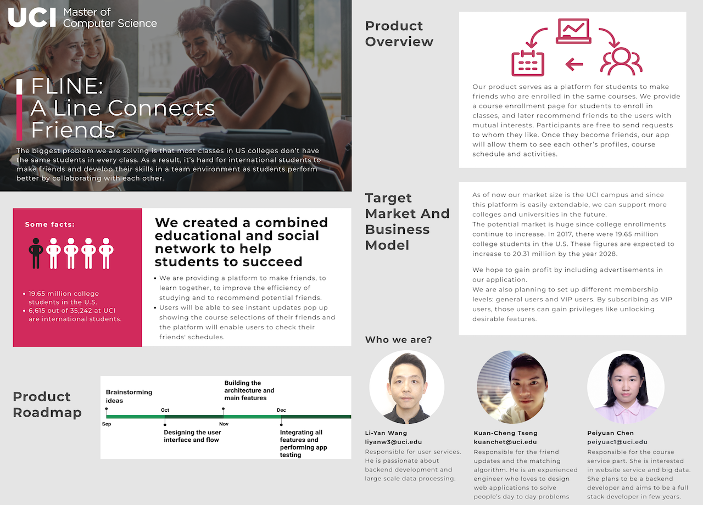

# CS297P Capstone Project: FLine

**FLine** (pronounced "F Line") is the Master Capstone Project created by 3 of UC Irvine Computer Science students. It is a social app made for college students to make friends with each other around their campus based on our recommendation system. 

We are all international students traveling to the US for our next life goals. We can relate so much that foreign students need to overcome many difficulties before they can succeed in classes. And that's why we build this app, because "you can fight wars yourself, but you are likely to win them all with your allies." By the way, who knows that the next ally you make might become your best friend in the end, that's totally a win-win.

**Here's how it works**: you select courses in our system just  like you did it in your school registration system, you see your classmates who are also enrolled in the same classes, and we match you with them, who we believe are similar to you and could be your potential friends, than't it! If you are interested in this project, please take a look at below for the details:

  

## Setup

Contact developers for full configurations and copy `.env.local` to `.env`, then fill in all the parameters as needed. To start, run:

```shell
// install required pakages
$ npm install
// you may need to build next files before startign the server
$ npm run build
// start the server in development mode
$ npm run dev
```

and navigate your browser to `localhost:3000` 

## Folder Structure

```
.
├── client                  # front-end
│   ├── pages               # views
│   │   ├── index.js        # main page
│   │   ├── user            # pages for user functions
│   │   ├── friend          # pages for friend functions (*)
│   │   ├── course          # pages for course functions (*)
│   │   └── ...             # other pages (*)
│   └── components          # reusable modules for views
│       └── ...             # (*)
├── node_modules            # packages used in this project
├── public                  # 
├── server                  # backend:
│   ├── models              # database interface
│   │   ├── db.js           # database connection
│   │   ├── user.js         # operations for user database
│   │   └── ...             # operations for other database (*)
│   ├── routes              # server-side router
│   │   ├── index.js        # routing table
│   │   ├── users.js        # api for user logics
│   │   └── ...             # api for other logics (*)
│   └── index.js            # entry point for the server
├── .env                    # environment variables and constant
├── .env.local              # environment variables and constant
├── package.json            # package and npm script configurations
└── README.md               # 
```

The folders with `(*)` appended are where new features should be added.

## Features

### Course and personal schedule

**Course Page**: User can browse and search courses, take and drop courses, and review the courses they selected 


**Schedule Page**: Users can check their schedules and friends’ schedules for different terms 


### Friend and recommendation system

**Main Page**: Users can get the newsfeed about their friends' registration


**Friend List Page**: Users can manage the Friend List and reply to a friend request


**Recommendation page**: 

Classmates list with matching scores alongside each person's thumbnails to help users find their friends.

 

## People Behind the Scene

* [Li-Yan Wang](https://github.com/hydnwang) 
* [Peiyuan Chen](https://github.com/poppy567) 
* [Kuan-Cheng Tseng](https://github.com/qsharker) 